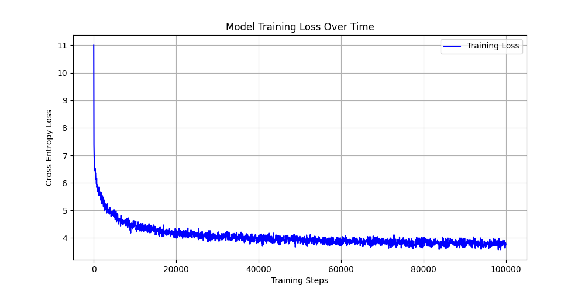
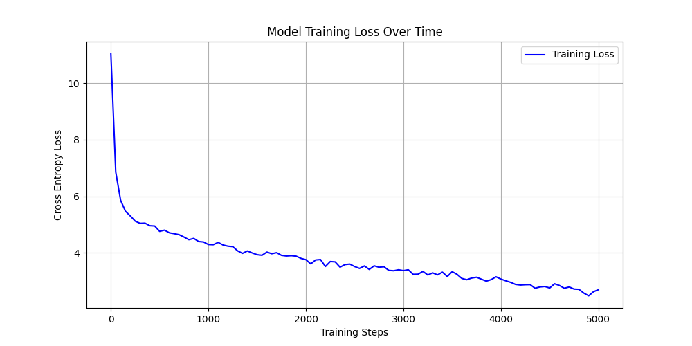

# GPT-2 Implementation (PyTorch)

## Custom GPT-2: From Scratch to Poetry
A fully custom, from-scratch implementation of a Transformer language model. This repository contains the complete pipeline for streaming massive datasets, pre-training a 83-million parameter language model on raw internet text, and fine-tuning it for style mimicry (Haikus)—all engineered to run locally on consumer hardware.

## Overview
Instead of relying on high-level wrapper libraries, this project implements the core mechanics of Large Language Model training. The goal was to build a highly memory-efficient, mathematically stable pipeline capable of training a custom GPT-2 architecture on a RTX 3060 (12GB) GPU without Out-Of-Memory (OOM) crashes.

## Output example

### Pre-trained
'''sh
python run.py --mode gen --prompt "Before we" --weights "data/pretrain.pth" --tokens 50
'''
'''
Before we begin, we should put our heads up the stairs.”

One of the best moments in the film is the curvature of his red disk. The most noticeable difference is the crystal ball of the disc, which is bow-like in
'''

### Finetuned on haiku dataset
'''sh
python run.py --mode gen --prompt "The" --weights "data/haiku.pth" --times 10
'''
'''
The summer Master. / To the will play us. / For meadow shape.
The city. / Fail of the milkzing. / And she loved him down.
The wind and heart. / If they love me food. / In the same rain.
The most Truman'so. / We are my hair. / In the head of rain.
The day written? / The rafters. / Of the storm carries rain.
The you. / Mean me for you, we take? / Just a big dashboard.
The even love. / And what a computer she saw. / To a mother.
The long night. / Winter sunlight remains. / Just rooted at the window.
The wind. / To be more. / To the ice.
The reddness. / Behind the old lights. / Sim down the chimes.
'''

## What Was Implemented
Custom GPT-2 Architecture: Built entirely in PyTorch, featuring a 512-token context window, 8 attention heads, and 10 transformer blocks (approx. 83M parameters).

Zero-Copy Data Streaming: Implemented a highly optimized disk-to-GPU data pipeline using lance and pyarrow. Bypassed standard Python memory bottlenecks to stream millions of tokens with a flat ~1GB System RAM footprint.

Custom Training Loop: Built from the ground up, featuring:

Gradient Clipping: Preventing explosive gradients during the volatile early stages of training.

Mixed Precision (bfloat16): Thread-safe implementation of torch.autocast across multiple GPUs via nn.DataParallel.

Automated Logging: Real-time ETA calculations, loss tracking, and automatic matplotlib loss curve generation.

## The Training

Both pre-training and finetuning has been done using the same train command.
'''sh
python -u run.py --mode train \
    --data data/haiku_dataset.lance \
    --output data/haiku.pth >> log2.txt 2>&1
'''

Phase 1: Pre-Training on the Open Web
The model was initialized with completely random weights and pre-trained on a subset of OpenWebText.

Dataset: [heyytanay/openwebtext-1m](https://www.kaggle.com/datasets/heyytanay/openwebtext-1m)

Objective: Next-token prediction to learn fundamental English grammar, spelling, and sentence structure.

Duration: ~100,000 steps (approx. 3.2 Billion tokens).

Hardware: Nvidia RTX 3060 (12GB VRAM).

Result: Reached a stable Cross-Entropy loss of ~3.75. The model successfully learned to form coherent *-ish*, grammatically correct paragraphs from scratch.

Phase 2: Fine-Tuning (Style Mimicry)
Because a 83M parameter model lacks the capacity to store factual world knowledge, it was fine-tuned for style mimicry.

Dataset: [statworx/haiku](https://huggingface.co/datasets/statworx/haiku)

Process: The dataset was tokenized, appended with <|endoftext|> delimiters, and compiled into a Lance database. The pre-trained model was loaded and fine-tuned with a severely reduced learning rate (5e-5).

Result: The model successfully overfit to the 5-7-5 syllable structure, generating novel, grammatically correct haikus.

## Model Weights
The final trained weights are too large for GitHub, but you can download them directly from Hugging Face and plug them into the generation script!

👉 [Weights available on Hugging Face](https://huggingface.co/krstff/gpt2)

## Lessons Learned & Engineering Challenges

The implementation itself eg. using blocks to build the entire network, multi-headed masked self attention, the headache of rotating and transforming matrices.

Python List RAM issue: Initially attempted to load a pre-tokenized 1-billion token dataset using standard Python lists, which ballooned a 8GB dataset into over 36GB of RAM, crashing the system. Fixed by keeping data in raw Arrow arrays and streaming it directly to PyTorch tensors.

The "Open Book" Label Bug: Discovered that failing to explicitly slice and shift inputs (x = batch[:, :-1]) and targets (y = batch[:, 1:]) in the dataloader allows the attention mechanism to look at the answer, causing the loss to artificially plummet to near-zero.

Multi-GPU computation: initially I wanted to make use of two RTX 3060s, but because the lanes on my motherboard are slow (16x 4x) and some other issues showed up with mixed precision. I decided to stick to a single GPU. The code is still 'ready' for multiple GPUs (nn.DataParallel), but a global torch.autocast wrapping is needed.

Strongly inspired by: https://github.com/karpathy/minGPT
